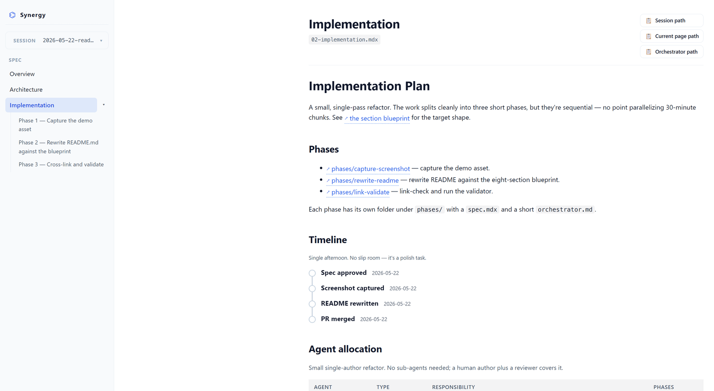

# Synergy

[](LICENSE)
[](https://www.claude.com/claude-code)
[](package.json)
[](tsconfig.json)

**Spec-driven planning for Claude Code.** Turn vague requests into MDX specifications with status badges, phase plans, agent allocations, charts, and cross-references — rendered live in your browser as you author them, then implemented phase-by-phase with live status and a resumable hand-off trail.

Markdown specs go stale in a terminal. Synergy gives agents a tight component vocabulary, a validator that enforces it, and a Vite preview that hot-reloads on every save.

## Demo



The preview at `http://localhost:4321` gives each MDX file its own route (`/s/<name>/overview`, `/architecture`, `/implementation`, `/phases/<slug>`), a hierarchical left sidebar (sessions dropdown, spec rows, phases nested under Implementation), and per-page copy-path buttons for the session dir, the current page, and the orchestrator. The orchestrator opens as a right-side slide-out drawer (ESC or backdrop to close) rendering `orchestrator.md`, and every page hot-reloads as Claude Code edits the MDX.

## Edit & review in the browser

The preview isn't read-only — you can fix and annotate specs without a round-trip through Claude:

- **Inline edits.** Prose blocks (paragraphs, list items, headings) are editable in place. Changes live in a browser-side buffer with an explicit **Apply** (writes the MDX file) or **Discard** per block — plus **Apply all / Discard all** in the top toolbar. Never auto-saves; an unload guard warns on unsaved edits.
- **Comments.** Select any text, click the **+**, and leave a note for Claude. Each comment is a markdown file under `.synergy/feedback/<session>/` with a line/col + surrounding-context anchor so it survives later edits.
- **Diff view.** Toggle **🔍 Diff** on any page to highlight what changed since you last reviewed the file (git-backed: committed + uncommitted), then **Mark as reviewed** to advance the cursor.
- **Hand back to Claude.** Run `/synergy-feedback` — the `synergy:address-feedback` skill reads the open-comment queue for the browser-active session, edits each referenced location, and marks every comment resolved or rejected (never silently dropped).

Edits, comments, and review state all persist to disk (MDX files, `.synergy/feedback/`, and a gitignored `review-state.json`) — git is the version history, so there's no database.

## Execute & hand off

Authoring is half the loop. Once a plan exists, agents implement against it — and Synergy records what actually happened in a committed `.state/` sidecar per session, so progress is visible and a fresh-context agent can pick up cleanly:

- **Disciplined execution.** `/synergy-execute <session>` works one phase at a time and **can't move past a phase boundary** without recording it: it flips the phase status, writes a terse boundary note, drops ad-hoc findings, and updates the resume pointer — all through the CLI, never by hand-editing state. It fans out sub-agents and teams per the `<AgentAllocation>` plan (model + effort + count), and takes run-time directives ("only Phase 1", "use sonnet this run") that layer over the plan without mutating it.
- **Clean hand-off.** `/synergy-resume <session>` is the fresh-context entry point: it reads the resume pointer and journals *first* (state → strategy → detail), then continues from exactly where the last agent stopped. Clear the session, start a new one, and nothing is lost.
- **Live progress in the browser.** Every `<Phase id>` badge reflects real status from `.state/`, and a 📊 **Progress drawer** shows the derived rollup (e.g. "2 / 5 phases done"), per-phase journals, and the cross-cutting log — hot-reloading like everything else.

Per-phase status and journals are the source of truth; overall progress is **derived** (never stored, so it can't drift). The `.state/` directory is committed to git — it's the shared hand-off record, not per-user scratch.

## Install

Prerequisites: **Node ≥ 20**, **pnpm** (`corepack enable` if missing).

```
/plugin marketplace add sanzhardanybayev/synergy
/plugin install synergy@synergy
/synergy-setup
```

`/synergy-setup` runs `pnpm install && pnpm build` inside the plugin once. After that, the slash commands and skills are ready.

<details>
<summary>Install from a local clone</summary>

```bash
git clone https://github.com/sanzhardanybayev/synergy
# In Claude Code:
/plugin marketplace add /absolute/path/to/synergy
/plugin install synergy@synergy
/synergy-setup
```
</details>

## Quick start

```
/synergy-init                              # once per project
/synergy-spec "Add rate limiting"          # creates a session + opens browser
# ...edit MDX with Claude Code, preview hot-reloads...
/synergy-validate                          # before commit
/synergy-execute                           # implement it, phase-by-phase (state-tracked)
```

That's the loop. The first command scaffolds `.synergy/sessions/` in your project. The second invokes the `synergy:create-spec` skill — which reasons about scope, picks `.synergy/sessions/YYYY-MM-DD-add-rate-limiting/`, scaffolds the overview + optional architecture/implementation/phase folders, and opens your browser. The third checks schemas and cross-references before you ship. The fourth implements the plan one phase at a time, recording status and findings as it goes — and `/synergy-resume` picks it back up in a fresh session.

## Reference

### Slash commands

| Command | Purpose |
|---|---|
| `/synergy-init` | Scaffold `.synergy/` in the current project. Once per project. |
| `/synergy-spec "<title>"` | Create a new spec session (also auto-starts preview, opens browser). |
| `/synergy-validate [session]` | Validate schemas + cross-refs. Zero errors before commit. |
| `/synergy-feedback [session]` | Address browser-collected comments for the active session (edits specs, resolves/rejects each). |
| `/synergy-execute [session] [directives]` | Implement a session phase-by-phase, updating execution state at each boundary. |
| `/synergy-resume [session] [directives]` | Resume an in-progress session from its execution-state hand-off. |
| `/synergy-preview-start` | Boot the preview server on port 4321. Idempotent. |
| `/synergy-preview-stop` | Kill the preview server, remove PID file. |
| `/synergy-preview-status` | Report running / stopped, pid, URL. |
| `/synergy-setup` | One-time bootstrap (install + build). |

### CLI subcommands

For terminal users — available at `node "$CLAUDE_PLUGIN_ROOT/packages/cli/dist/cli.js" ...` after `/synergy-setup`. Spec authoring is a skill, not a CLI command — use `/synergy-spec` (which invokes the `synergy:create-spec` skill).

| Command | Flags | Purpose |
|---|---|---|
| `synergy init` | `--root <dir>` | Scaffold `.synergy/` |
| `synergy preview <action>` | `--root`, `--port` (default 4321) | `start \| stop \| status` |
| `synergy validate [session]` | `--root` | Validate sessions in `.synergy/sessions/` |
| `synergy phase set <session> <id> <status>` | `--root`, `--note` | Record a phase status + optional boundary note |
| `synergy log <session> <text>` | `--root`, `--phase <id>`, `--global` | Append a finding to a phase or the global journal |
| `synergy resume <session>` | `--root`, `--next <id>`, `--note` | Write the hand-off pointer a fresh agent reads first |
| `synergy status <session>` | `--root` | Print the execution-state rollup (phases done / total) |

### Spec-kit components

Imported from `@synergy/spec-kit`. Props are schema-validated; cross-references are link-checked.

| Component | Required props | One-line purpose |
|---|---|---|
| `<Status>` | `value` | Lifecycle badge: `draft`, `proposed`, `in-progress`, `blocked`, `done`, `shipped` |
| `<Phase>` | `number`, `title` | Phase summary card for the index in `02-implementation.mdx`; give it a stable `id` slug so execution state and live status badges bind to it. The real phase body lives in `phases/<NN>-<slug>/spec.mdx` |
| `<Timeline>` | `milestones` | Ordered visual milestones with optional dates and statuses |
| `<SubSpec>` | `slug`, `title` | Link card to a sibling spec file |
| `<CrossRef>` | `to` | Inline reference; `to="<spec-slug>"`, `"<spec-slug>#<anchor>"`, or `"phases/<slug>"` for phase folders |
| `<AgentAllocation>` | `entries` | Table of agents (`sub-agent`, `agent-team`, `human`), ownership, and per-agent fan-out (`model`, `effort`, `count`) that `/synergy-execute` spawns against |
| `<Team>` | `name`, `members` | Group of contributors with roles |
| `<Reviewer>` | `name`, `role`, `scope` | Reviewer and their sign-off scope |
| `<OpenQuestion>` | `question` | Unresolved decision blocking progress |
| `<Risk>` | `title`, `severity` | Known hazard with optional mitigation |
| `<Mockup>` | `src`, `alt` | Image with caption (relative to session `assets/`) |
| `<Chart>` | source as children | Mermaid diagram (`flow`, `sequence`, `state`, `gantt`, `er`, `mindmap`, `architecture`) |

For visuals beyond Mermaid, drop a custom component in `.synergy/sessions/<name>/_components/` and import it locally.

## Authoring rules

Four rules. Full text in [AGENTS.md](AGENTS.md).

1. **Components over markdown.** Use spec-kit components for structured content. If the shape doesn't exist, build a session-local component — don't fall back to raw markdown.
2. **CrossRefs, not links.** Spec-to-spec navigation uses `<CrossRef to="...">`. The validator catches dangling refs; raw markdown links it can't.
3. **Every session ships an `orchestrator.md`.** Plain markdown, not MDX, so it's readable in any tool. Describes dependency graph, parallel chunks, sub-agent vs agent-team strategy, verification gates.
4. **Validator is the gate.** `synergy validate` returns zero errors before a session is considered ready.

## Troubleshooting

**"vite binary not found" or "command not found"** — the plugin's workspace isn't built. Run `/synergy-setup`. If pnpm itself is missing, `corepack enable` or `npm i -g pnpm`.

**"port 4321 in use"** — another process owns the port. Run `/synergy-preview-stop` first; if a different program holds it, identify with `lsof -i :4321` and quit it before retrying.

**Validation fails on `<CrossRef>`** — the target slug or heading anchor doesn't exist in the session. Either fix the `to=` value or add the heading. Anchors are GitHub-style: lowercase, spaces → `-`, special chars stripped.

## License & links

MIT. See [AGENTS.md](AGENTS.md) for spec-authoring rules, [CLAUDE.md](CLAUDE.md) for project conventions, [SYNERGY_PLAN.md](SYNERGY_PLAN.md) for the original design.
